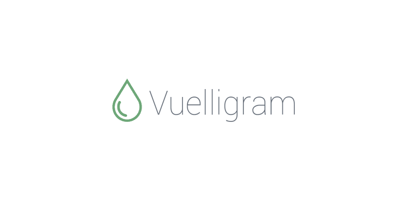

Vuelligram is a stupidly lightweight components library based on the [Milligram CSS Framework](https://milligram.io/).

## Installation

```
npm install -S vuelligram
```

## Usage

```html
<template>
	<m-button>Use Vuelligram<m-button>
</template>

<script>
import { MButton } from "vuelligram/button";

export default {
	components: { MButton }
}
</script>
```

## Components

- Blockquotes
- Buttons
- Code
- Forms (Input, Select, Textarea)
- Lists
- Tables

## Project setup
```
npm install
```

### Compiles and hot-reloads for development

```
npm run serve
```

### Compiles and minifies for production

```
npm run build
```

### Run your unit tests

```
npm run test:unit
```

### Lints and fixes files

```
npm run lint
```
